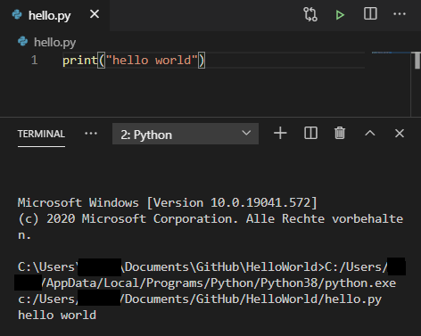

# Hello World

In this repository the code for printing "Hello World" in Python in the terminal is given. 

The screenshot below shows the code itself as well as the output.

# Usage
After installing Python and cloning the repository, the code can be run in any programming editor. 
As output of the code "Hello World" should be displayed in the terminal.

